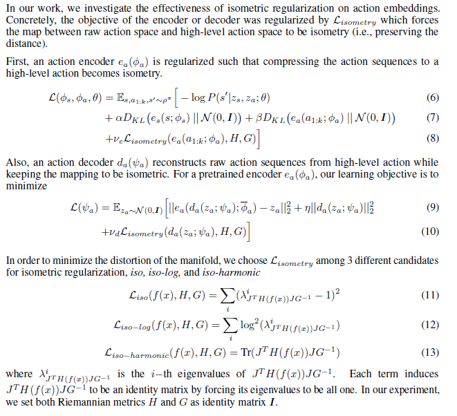

# Isometric-Regularization-RL
Code and paper for brief research about Isometric Regularization for high-level actions on Dynamic-Aware Embeddings.

This project aims to implement the minimum distortion embedding ideas of manifold learning to reinforcement learning, based on DynE(https://arxiv.org/abs/1908.09357) and its code(https://github.com/willwhitney/dynamics-aware-embeddings). The project report and results are attached in `./project_results`.

## How to train
Train embedding:
```bash
python embedding/main_iso_<embedding_type>.py --env <env_name>
ex) python embedding/main_iso_harmonic.py --env ReacherVertical-v2
```

Train agent:
```bash
python rl/main_iso_<embedding_type>.py --env <env_name>
ex) python rl/main_iso_harmonic.py --env ReacherVertical-v2
```

Plot results:
```bash
python rl_plots.py
```

## Evaluation Result


## Methodology

